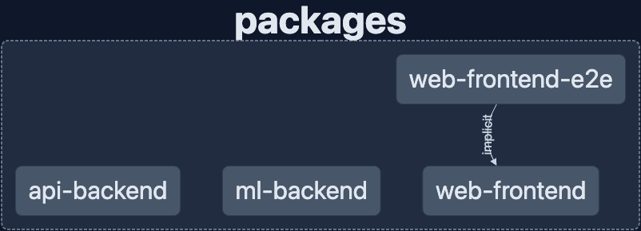

# 🚀 voyage-tasks

- [🚀 voyage-tasks](#-voyage-tasks)
  - [📚 Project Description](#-project-description)
  - [🏗️ Architecture](#️-architecture)
  - [📝 Requirements](#-requirements)
  - [🏃‍♂️ Get started](#️-get-started)
  - [🛠️ How Nx Works](#️-how-nx-works)
    - [➕ Additional Commands](#-additional-commands)
      - [📦 Adding Dependencies](#-adding-dependencies)
      - [🧪 Running Tests](#-running-tests)
      - [🔍 Linting](#-linting)
      - [🌐 Building for Production](#-building-for-production)
    - [🎩 Tips and Tricks](#-tips-and-tricks)
  - [📖 Chingu Documentation](#-chingu-documentation)


## 📚 Project Description

A platform that allows users to input their monthly utility bills and track their energy consumption. The system would offer suggestions on how to reduce energy costs based on data analysis, as well as compare a user's consumption to regional or national averages.

## 🏗️ Architecture


- **web-frontend**: The frontend of the application, built with React. (User interface, etc.)
- **api-backend**: The backend of the application, built with FastAPI. (Authentication, Database, etc.)
- **ml-backend**: The machine learning backend of the application, built with FastAPI. (Data analysis, etc.)

## 📝 Requirements 

- [Node.js](https://nodejs.org/en/) (v18)
- [Python](https://www.python.org/) (v3.9 or higher)
- [Poetry](https://python-poetry.org/)
- [Docker](https://www.docker.com/)
- [Docker Compose](https://docs.docker.com/compose/)

## 🏃‍♂️ Get started

1. Clone this repo

```bash
git clone git@github.com:chingu-voyages/v46-tier3-team-42.git
```

2. Install dependencies

```bash
# To install dependencies for the frontend
npm install
# To install dependencies for the api backend
npx nx run api-backend:install
# To install dependencies for the ml backend
npx nx run ml-backend:install
```

3. Run the app

```bash
# To work on the frontend
npx nx run web-frontend:serve:development
# To work on the api backend
npx nx run api-backend:serve:development
# To work on the ml backend
npx nx run ml-backend:serve:development
```

## 🛠️ How Nx Works

**Nx** is a powerful, extensible dev tools workspace for monorepos. With Nx, you can develop multiple full-stack applications holistically and share code between them, all while keeping everything fast and maintainable.

### ➕ Additional Commands

#### 📦 Adding Dependencies

If you want to add dependencies specific to a certain app or library, you can do so by specifying the project:

```bash
# Add dependency to the frontend
npm install [YOUR_PACKAGE_NAME]
npm install [YOUR_PACKAGE_NAME] --save-dev

# Add dependency to the api backend
npx nx run api-backend:add --name [YOUR_PACKAGE_NAME]
npx nx run api-backend:add --name [YOUR_PACKAGE_NAME] --group dev

# Add dependency to the ml backend
npx nx run ml-backend:add --name [YOUR_PACKAGE_NAME]
npx nx run ml-backend:add --name [YOUR_PACKAGE_NAME] --group dev
```

#### 🧪 Running Tests

Nx comes with built-in test configuration, making it easy to test individual projects:

```bash
# Run tests for the frontend
npx nx test web-frontend

# Run tests for the api backend
npx nx test api-backend

# Run tests for the ml backend
npx nx test ml-backend
```

#### 🔍 Linting

Ensure your code follows best practices and stays consistent:

```bash
# Lint the frontend
npx nx lint web-frontend

# Lint the api backend
npx nx lint api-backend

# Lint the ml backend
npx nx lint ml-backend
```

#### 🌐 Building for Production

When you're ready to deploy:

```bash
# Build the frontend for production
npx nx build web-frontend --prod

# Build the api backend for production
npx nx build api-backend --prod

# Build the ml backend for production
npx nx build ml-backend --prod
```

### 🎩 Tips and Tricks

- **Use affected commands**: Nx can determine which apps and libs are affected by a certain change. For instance, if you made a change to a shared library, you can run tests only for the apps that are affected by this change:

```bash
npx nx affected:test
```

- **Generating Code**: Nx provides various generators to help scaffold components, modules, services, and more:

```bash
npx nx generate @nrwl/react:component myComponent --project=web-frontend
```

- **Interactive Console**: You can access the Nx Console, an interactive UI for Nx commands, by running:

```bash
npx nx console
```

## 📖 Chingu Documentation

Your project's `readme` is as important to success as your code. For 
this reason you should put as much care into its creation and maintenance
as you would any other component of the application.

If you are unsure of what should go into the `readme` let this article,
written by an experienced Chingu, be your starting point - 
[Keys to a well written README](https://tinyurl.com/yk3wubft).

And before we go there's "one more thing"! Once you decide what to include
in your `readme` feel free to replace the text we've provided here.
